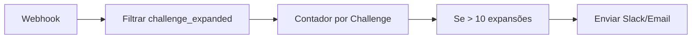
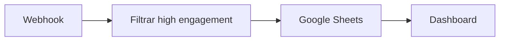
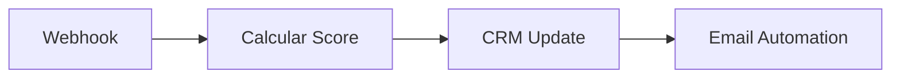

# Configuração do Webhook N8N para Jedi Challenges

Este guia explica como configurar um webhook no N8N para receber e processar eventos do site Jedi Challenges.

## 🎯 Visão Geral

O site está configurado para enviar eventos detalhados para um webhook N8N, permitindo análise avançada de comportamento dos usuários, automação de marketing e insights sobre quais challenges são mais populares.

## 🔧 Configuração do Webhook

### 1. Configurar URL do Webhook

No arquivo `index.html`, substitua a URL do webhook:

```javascript
const WEBHOOK_CONFIG = {
    url: 'https://sua-instancia-n8n.com/webhook/jedi-challenges', // ← Substitua aqui
    enabled: true,
    retryAttempts: 3,
    retryDelay: 1000
};
```

### 2. Criar Workflow no N8N

1. **Abra o N8N** e crie um novo workflow
2. **Adicione um nó Webhook**:
   - HTTP Method: `POST`
   - Path: `/jedi-challenges` (ou personalizado)
   - Response Code: `200`
   - Response Data: `success`

3. **Configure Headers** (opcional):
   - `Content-Type: application/json`

## 📊 Tipos de Eventos Enviados

### 1. **page_view**
Quando o usuário visita a página:
```json
{
    "event_type": "page_view",
    "page_title": "CloudWalk AI Jedi Challenges",
    "page_path": "/",
    "page_search": "",
    "page_hash": "",
    "timestamp": "2024-01-15T10:30:00.000Z",
    "userAgent": "Mozilla/5.0...",
    "sessionId": "jedi_1642242600000_abc123"
}
```

### 2. **challenge_expanded** (Evento mais importante)
Quando um usuário clica para expandir um challenge:
```json
{
    "event_type": "challenge_expanded",
    "challenge_name": "cloudwalk-chatbot",
    "challenge_title": "💬 CloudWalk Chatbot",
    "challenge_level": "Level 1: Padawan – Light Side Missions",
    "challenge_summary": "Build a chatbot that explains what CloudWalk is...",
    "interaction_type": "click",
    "user_engagement": "high",
    "timestamp": "2024-01-15T10:35:00.000Z",
    "sessionId": "jedi_1642242600000_abc123"
}
```

### 3. **challenge_hover**
Quando o usuário passa o mouse sobre um challenge:
```json
{
    "event_type": "challenge_hover",
    "challenge_name": "self-driven-game-platform",
    "challenge_title": "🎮 Self-Driven Game Platform",
    "challenge_level": "Level 2: Jedi Knight – Self-Driven Multi-Agent Companies",
    "interaction_type": "hover",
    "user_engagement": "medium"
}
```

### 4. **challenge_time_spent**
Tempo gasto com um challenge expandido:
```json
{
    "event_type": "challenge_time_spent",
    "challenge_name": "voynich-manuscript-decoder",
    "time_spent_ms": 45000,
    "time_spent_seconds": 45,
    "user_engagement": "high"
}
```

### 5. **scroll_depth**
Profundidade de scroll na página:
```json
{
    "event_type": "scroll_depth",
    "scroll_depth": 75,
    "max_scroll_depth": 85,
    "user_engagement": "high"
}
```

### 6. **time_on_page**
Marcos de tempo na página:
```json
{
    "event_type": "time_on_page",
    "time_spent_seconds": 120,
    "time_spent_minutes": 2,
    "milestone": 120,
    "user_engagement": "high"
}
```

### 7. **page_exit**
Quando o usuário sai da página:
```json
{
    "event_type": "page_exit",
    "total_time_spent_seconds": 180,
    "total_time_spent_minutes": 3,
    "max_scroll_depth": 90,
    "user_engagement": "high"
}
```

## 🔄 Workflows Exemplo

### Workflow 1: Notificação de Challenge Popular



**Configuração**:
1. **Webhook** - recebe eventos
2. **IF Node** - filtra `event_type === 'challenge_expanded'`
3. **Function Node** - conta expansões por challenge
4. **IF Node** - se contagem > 10 em 24h
5. **Slack/Email Node** - notifica time

### Workflow 2: Análise de Engajamento



**Configuração**:
1. **Webhook** - recebe eventos
2. **IF Node** - filtra `user_engagement === 'high'`
3. **Google Sheets Node** - salva dados
4. **Set Node** - processa métricas

### Workflow 3: Lead Scoring



**Pontuação**:
- `challenge_expanded`: +10 pontos
- `challenge_time_spent > 30s`: +5 pontos
- `scroll_depth > 75%`: +3 pontos
- `time_on_page > 2min`: +5 pontos

## 📈 Métricas Importantes

### Engajamento por Challenge
- **Expansões**: Quantas vezes cada challenge foi expandido
- **Tempo médio**: Tempo gasto em cada challenge
- **Taxa de conclusão**: % de usuários que chegam até o final

### Comportamento do Usuário
- **Tempo na página**: Duração da visita
- **Profundidade de scroll**: Quanto da página foi vista
- **Challenges favoritos**: Mais populares por nível

### Segmentação
- **Por nível**: Padawan vs Jedi Knight vs Grand Master
- **Por sessão**: Usuários que retornam vs novos
- **Por engagement**: Alto, médio, baixo

## 🛠️ Troubleshooting

### Eventos não chegando
1. Verifique se a URL do webhook está correta
2. Confirme que o N8N está ativo
3. Verifique logs do console no navegador

### Muitos eventos
1. Ajuste os marcos de tempo/scroll
2. Implemente rate limiting
3. Use debounce para eventos frequentes

### Dados inconsistentes
1. Verifique se `sessionId` está sendo mantido
2. Confirme timestamps
3. Valide estrutura JSON

## 🔒 Segurança

### Validação de Dados
No N8N, adicione validação:
```javascript
if (!items[0].json.sessionId || !items[0].json.event_type) {
    throw new Error('Dados inválidos');
}
```

### Rate Limiting
Implemente proteção contra spam:
```javascript
const maxEventsPerMinute = 100;
// Lógica de rate limiting
```

## 📊 Exemplo de Dashboard

Com os dados coletados, você pode criar dashboards mostrando:

1. **Challenges mais populares**
2. **Tempo médio de engajamento**
3. **Taxa de conversão por nível**
4. **Horários de maior acesso**
5. **Funil de engajamento**

## 🚀 Próximos Passos

1. **Configurar webhook URL** no `index.html`
2. **Criar workflow básico** no N8N
3. **Testar eventos** no console
4. **Implementar análises** específicas
5. **Criar alertas** para eventos importantes

---

**Nota**: Lembre-se de substituir `https://sua-instancia-n8n.com/webhook/jedi-challenges` pela URL real do seu webhook N8N. 